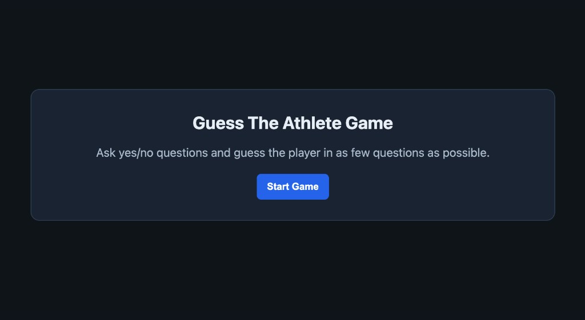
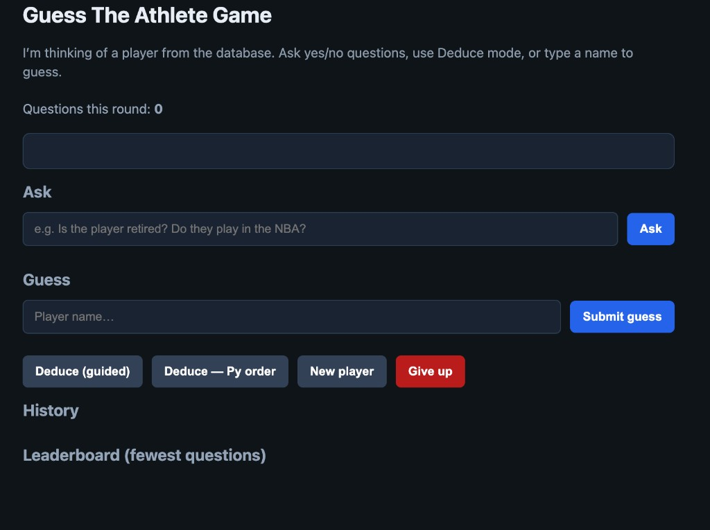

# Guess The Athlete Game - One Pager

## Project Snapshot

**Guess The Athlete Game** is a browser-based sports guessing game where the computer chooses a player from the four major North American leagues (NBA, NFL, MLB, NHL).  
Players ask yes/no questions, use guided deduction, or submit direct guesses to identify the hidden athlete in **under 25 questions**.

## What It Does

- Randomly selects an athlete from a multi-sport dataset.
- Answers user prompts in a strict yes/no format.
- Supports guided deduction mode to narrow possibilities quickly.
- Tracks question count and encourages efficient guessing.
- Includes an in-browser leaderboard for completed rounds.

## Why This Project

This project combines sports knowledge with game logic and lightweight front-end development in a single-page format.  
It is designed to be fast to run, easy to update, and easy to deploy.

## Tech + Structure

- **Stack:** HTML, CSS, JavaScript (no build step)
- **Main game file:** `index.html`
- **Extra mini-game:** `existential-snake.html`
- **Deployment helpers:** `publish.sh`, `quick-publish.sh`

## Run

Open `index.html` directly in a browser, or serve the folder with any static server.

## Important Screenshots

Add image files to `screenshots/` using the names below.

### 1) Home Page

### 2) Main Gameplay (Question + Answer)

### 3) Deduce Mode Panel

### 4) Correct Guess / Round Win

### 5) Leaderboard View

## Repository

[https://github.com/jhayward27-ui/jamesguessthatplayer](https://github.com/jhayward27-ui/jamesguessthatplayer)

## GitHub Pages Presentation

A polished web version of this one-pager is available in:

- `project-overview.html`

Use this as your showcase page on GitHub Pages.
